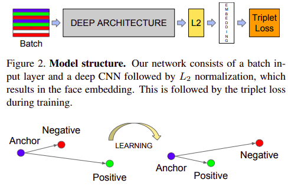

## Triplet loss on MNIST

Triplet loss is a loss function for machine learning algorithms where a baseline (anchor) input is compared to a positive (truthy) input and a negative (falsy) input. Triplet loss was first introduced in the paper [FaceNet: A Unified Embedding for Face Recognition and Clustering](https://arxiv.org/pdf/1503.03832v1.pdf). 

The Triplet Loss minimizes the distance between an anchor and a positive, both of which have the same identity, and
maximizes the distance between the anchor and a negative of a different identity. 

